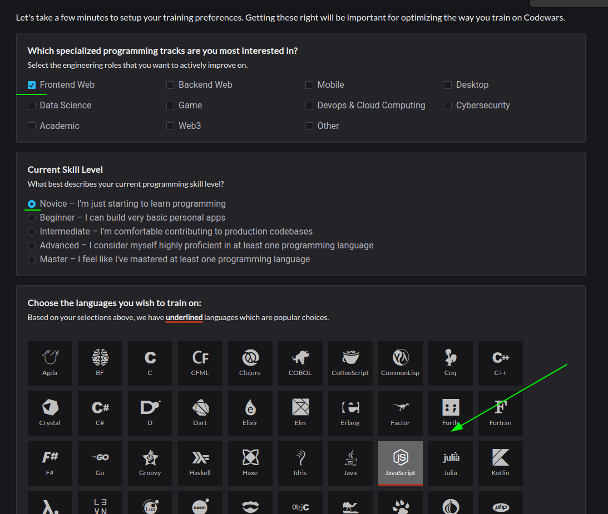
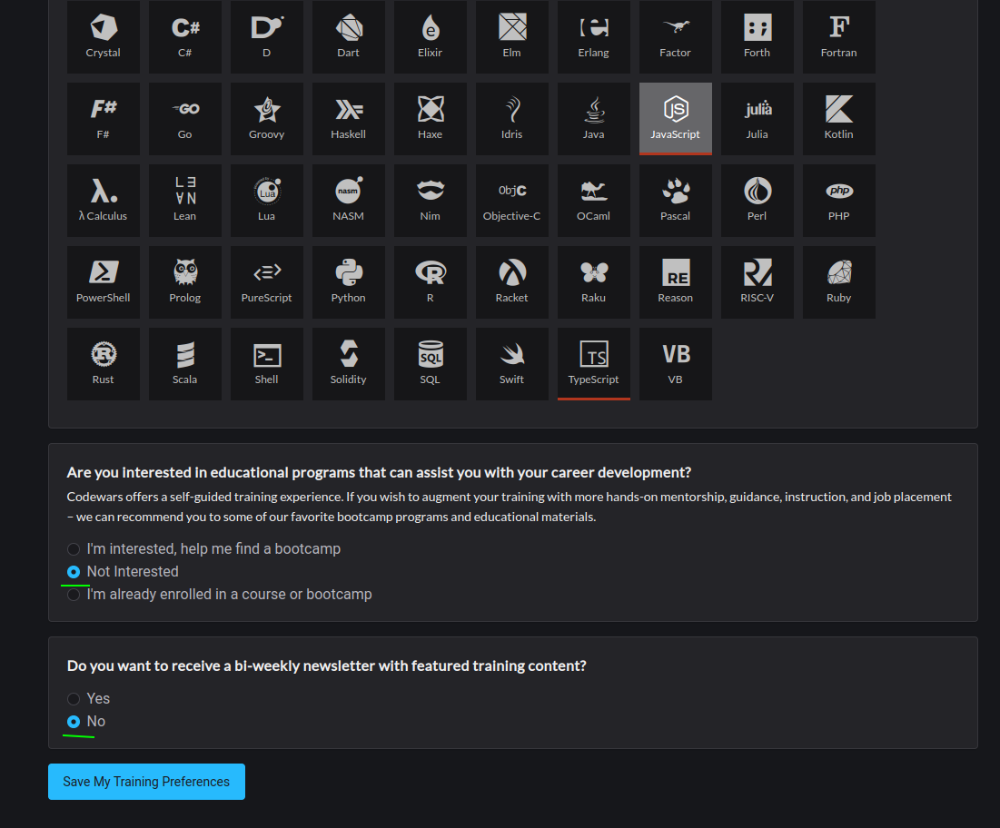
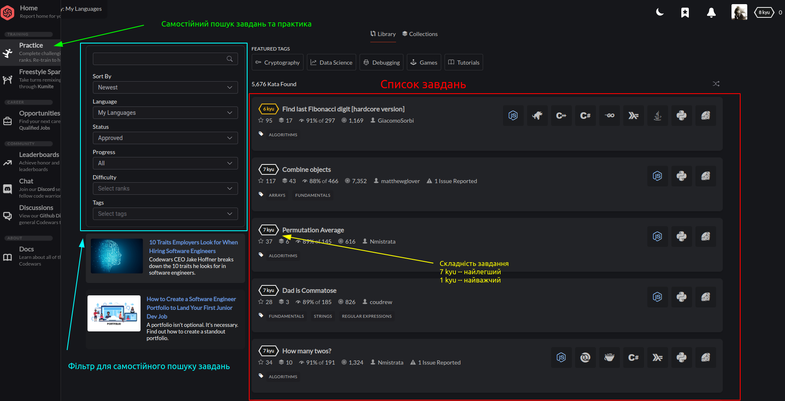
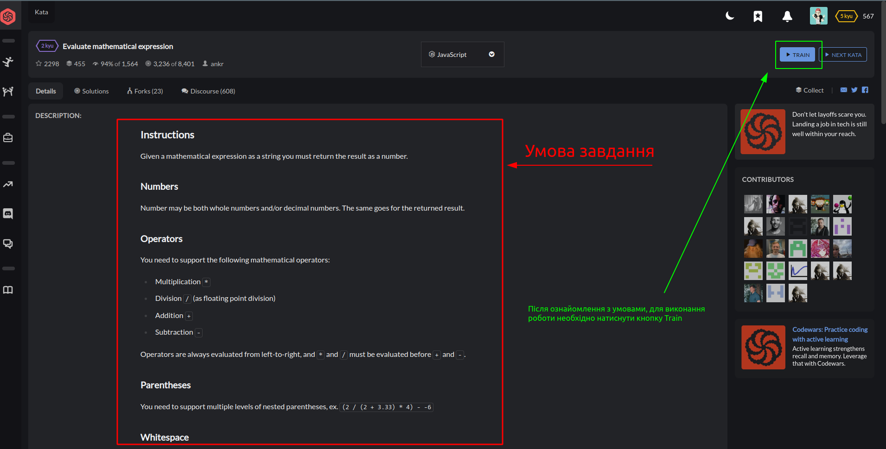
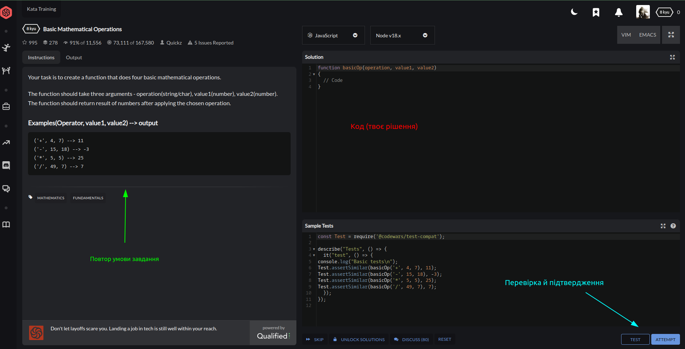
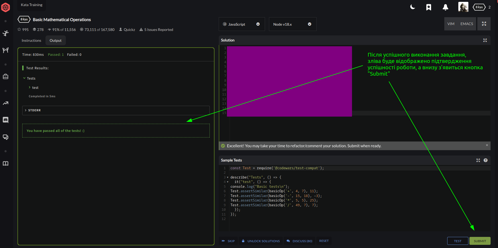

 ## Як працювати із codewars:

 - Після [реєстрації](https://www.codewars.com/users/sign_in) вибери потрібні тобі налаштування:
   
   

 - На лівій панелі можеш знайти кнопку Practice за допомогою котрої можна самостійно шукати завдання для практики, відповідно до твого рівня
 

 - Після вибору завдання, відкриється вікно з його умовою. Необхідно натиснути Train для виконання завдання
 

 - Вікно виконання завдання складається з Умови, поля для написання коду, тестів, та кнопки підтвердження
 

 - Після успішного виконання завдання, його можна підтвердити
 
   
